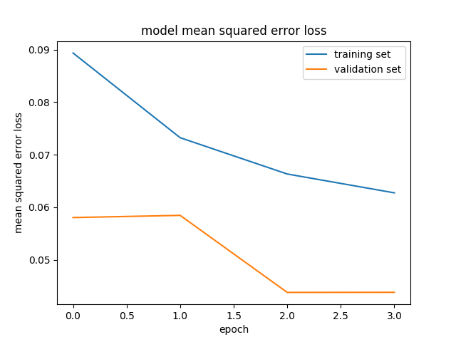

# **Behavioral Cloning** 

## Reflection
In this project the goal was to create a pipieline for a vehicle to drive automatically on a given test track.

**Behavioral Cloning Project**

The goals / steps of this project are the following:
* Use the simulator to collect data of good driving behavior
* Build, a convolution neural network in Keras that predicts steering angles from images
* Train and validate the model with a training and validation set
* Test that the model successfully drives around track one without leaving the road
* Summarize the results with a written report
s
### 1. Processing chain

The following items describe the steps of processing.

#### 1 Creating and loading the data
The simulator can create the data to for the classifier in "training mode". One is able to control the car over the test track with mouse, joystick or keyboard. I chose the mouse as input device. The data was stored in in a csv file and RGB images. The csv files contained the paths to a center left and right images (input data for the CNN) and (besides other information) the steering angle (as a target value for the CNN).

#### 2 Dataset 
The dataset was generated by using the simulator. Driving with the mouse as input led to better results because of smoother transitions and wider analogue range of the generated values. The steering angle corresponds to the center image. In order to make use of the left and right image I applied (as suggested in the instructions) a constant offset value as a correction to learn based on this images as well. Additionally horizontal flip of the image with the inversion  (*(-1)) of the steering angle was also applied. I generated sample data for both tracks in both directions (regular forward and "wrong way") . Addtionally I generated special exceprts from some curves to have more data for challenging situations. 
 
#### 3 Design and Test a Model Architecture
##### Dealing with the data set
Because the number of training samples in this case was very high a generator was used. The generater creates batches of samples for the classifier. The benefit is that not all samples images need to be stored in memory (RAM) at once. Only that portion which is currently consumed by the classifier is stored. Keras provides a function for the model which can deal with a generater with the Keras call model.fit_generator(args).

##### Model
I started with the original architecture from the NVIDIA paper from https://devblogs.nvidia.com/parallelforall/deep-learning-self-driving-cars/ also presented in the instructions. Since NVIDIA needed to deal with real world data and in our case we are dealing with artificial data I decided to simplify some layers and did some adaptions.

First of all the image was normalized and cropped because our region of interest (ROI) should exclude the sky and the bonnet of the car.

The CNN starts with three 2-D convolutions layers. Originall presented they had 5x5 kernels and 24, 36 and 48 and 64 layers. I decided to apply a smaller kernel (3x3) and 6,9 and 12 layers (leaving out one convolutional layer) because the data I present to the CNN is simpler then the data NVIDIA needed to handle. Subsampling was 2,2 in my case. Afterwards flattening is applied followed by fully-connected layers. In the NVIDA paper they had 1164 then 100, 50 and 10 neurons when finally the steering angle as a scalar (1-dim) is the output. I decided to reduce here as well. I.e. flattening output to 50 to 20 to 10 and finally to 1. All the fully connected layer have dropout layers in between of 50% to avoid overfitting and support generalization.

I agian used the Adam optimizer because it worked well in the other example as well. Adam realizes the benefits of both AdaGrad and RMSProp.

"Adaptive Gradient Algorithm (AdaGrad) that maintains a per-parameter learning rate that improves performance on problems with sparse gradients (e.g. natural language and computer vision problems).
Root Mean Square Propagation (RMSProp) that also maintains per-parameter learning rates that are adapted based on the average of recent magnitudes of the gradients for the weight (e.g. how quickly it is changing). This means the algorithm does well on online and non-stationary problems (e.g. noisy)."

Taken from (https://machinelearningmastery.com/adam-optimization-algorithm-for-deep-learning/)

#### Nominal performance of the classifier

Model mean squared error loss on the validation data was less than 5% as can be seen in the graph where mean squared error loss is shown over epochs. I chose 4 epochs because the learning did not increase significantly from the 4th epoch on.

#### Performance on the test track

The performance on the test track is good because the vehicle always stays on track and is most of the time stable. I modified drive.py to introduce a PID controller and increased the speed. During some runs I could not really see a benefit on the D part to I set it to 0 finally.

A video (video.mp4) is provided to see the performance on test track 1.

### 2. Shortcomings

#### A Complexity of the classifier
For the data given (artificial data with little variance) the classifier is still too complex and consumes both too much memory and too much computational time. When this was implemented on a real ECU for a car, complexity would need to be shrinked significantly.

#### B Performance on test track 2

### 3. Suggest possible improvements to your pipeline

#### A 
Invest more time in the network architecture and preprocessing (E.g. lines could be extracted the classical way and fed into the classifier as additional feature)

#### B 
Provide more data for test track 2 especially the tricky curves. Reduce the velocity to 9mph or even less. 

