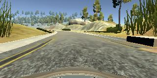

# **Behaviorial Cloning Project** 

Overview of relevant files
---
### model.py --- The script used to create and train the model.
### drive.py --- The script to drive the car. 
### model.h5 --- The saved model. 
### CarND-Behavioral-Cloning-P3.md --- Explanation of the structure of the network and training approach. Including examples of images from the dataset in the discussion of the characteristics of the dataset.
### video.mp4 --- A video recording of the vehicle driving autonomously at least one lap around the track.

